# Social. - Full-Stack Social Networking Web App

**Social.** is a fully functional Single Page Application (SPA) social networking platform, built with a robust client-server architecture. The application enables users to interact in real-time, share posts, leave comments, and build a network of connections (Follower system).

This project represents a comprehensive Full-Stack solution, featuring stateless authentication (JWT), complex relational database queries, and a highly responsive interface optimized for the best possible User Experience.

---

## Live Demo & API Documentation

The application is deployed and publicly accessible:
* **Frontend (Vercel):** https://social-kacper00000s-projects.vercel.app/
* **Swagger OpenAPI (Render):** https://social-8jcd.onrender.com/swagger-ui/index.html

> **Important Notes:**
> * **Backend Cold Start:** The Spring Boot backend is hosted on Render's free tier, which automatically spins down after periods of inactivity. Please allow **1-3 minutes** for the server to wake up upon your first request (e.g., during login or registration).
> * **Viewport Optimization:** This project is currently built as a **Desktop-first** application. Mobile responsiveness is not supported yet, so viewing on a desktop or laptop monitor is highly recommended for the best experience.
---

## Screenshots

**Login Page**:


**Register Page**:


**Home Feed**:
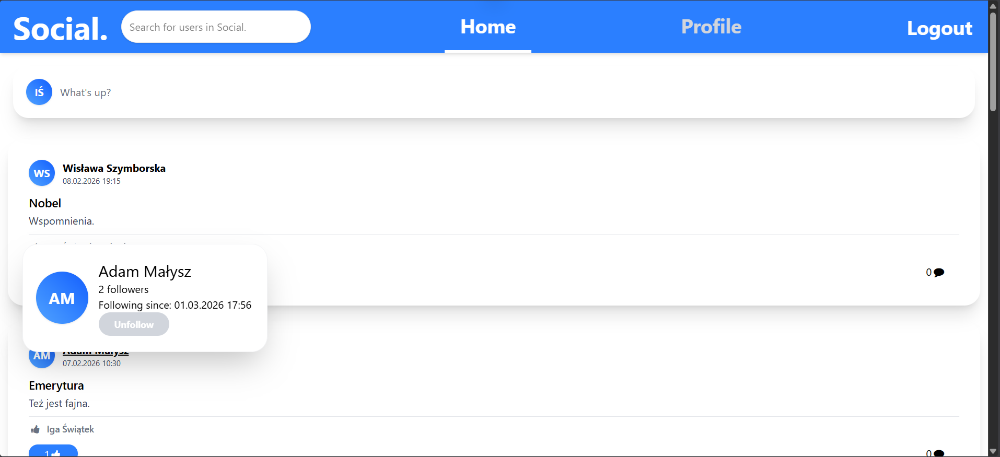
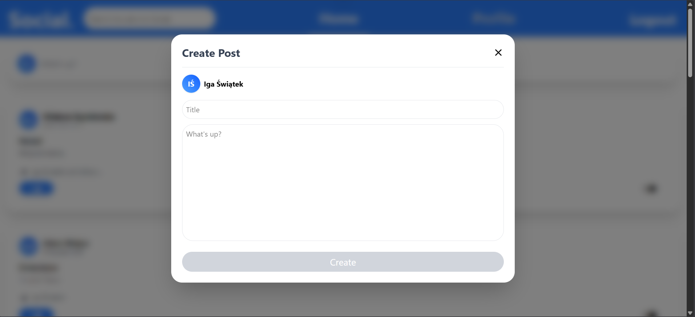

**Searching**:
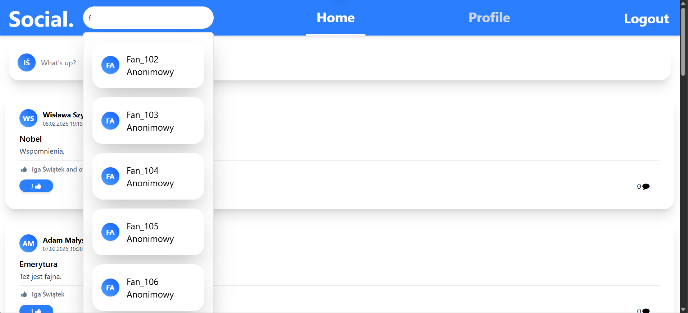
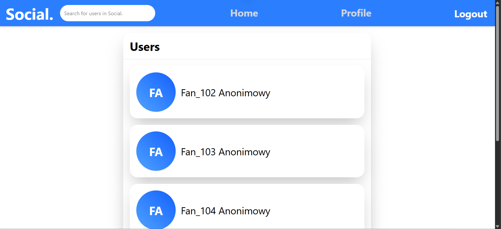

**Post and Comments View**:
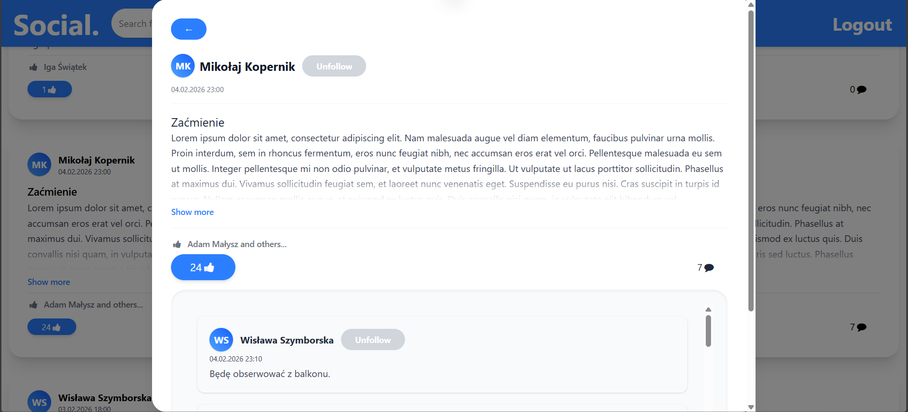
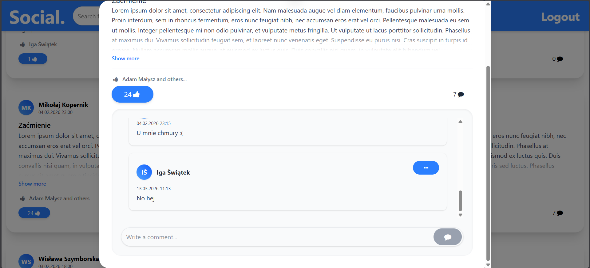

**Like list**:
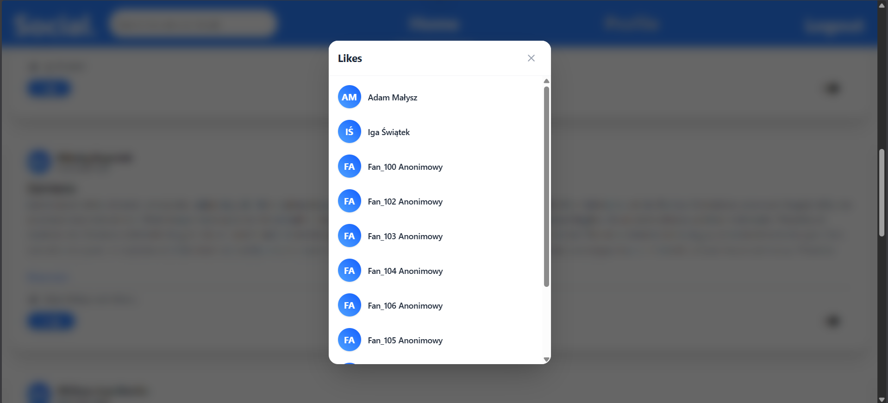

**Profile View**:
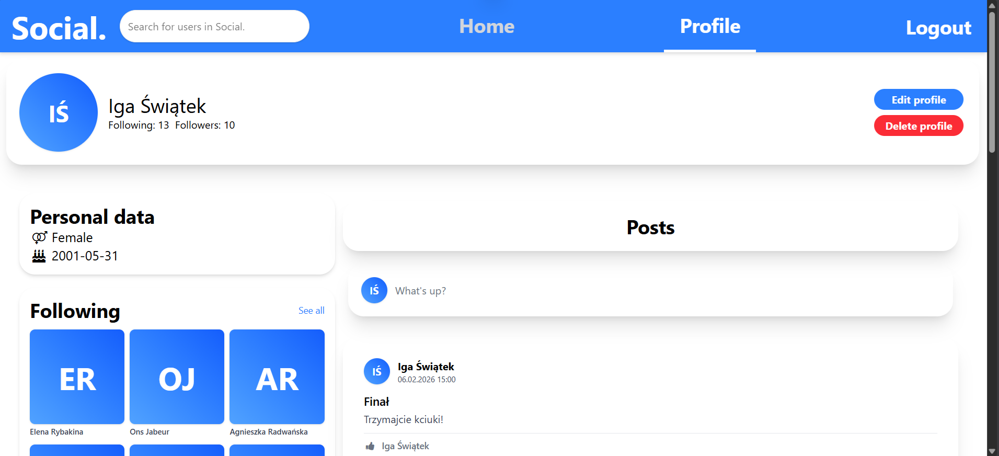
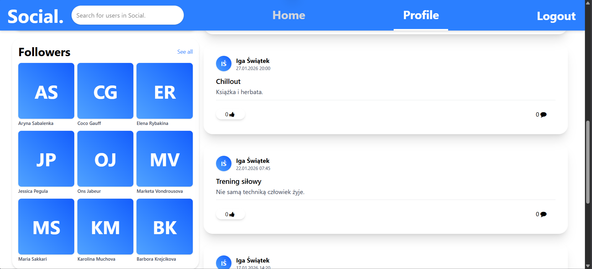
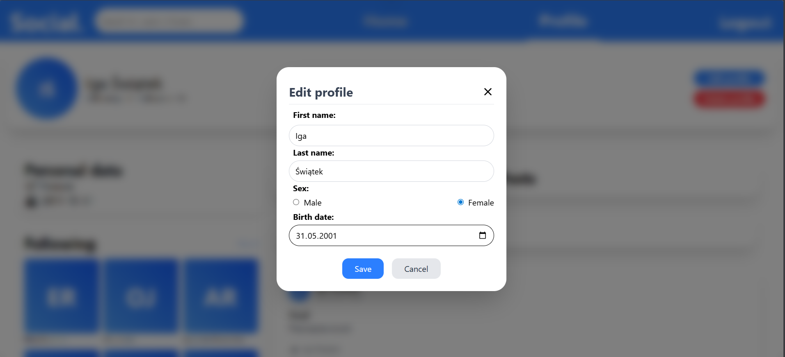
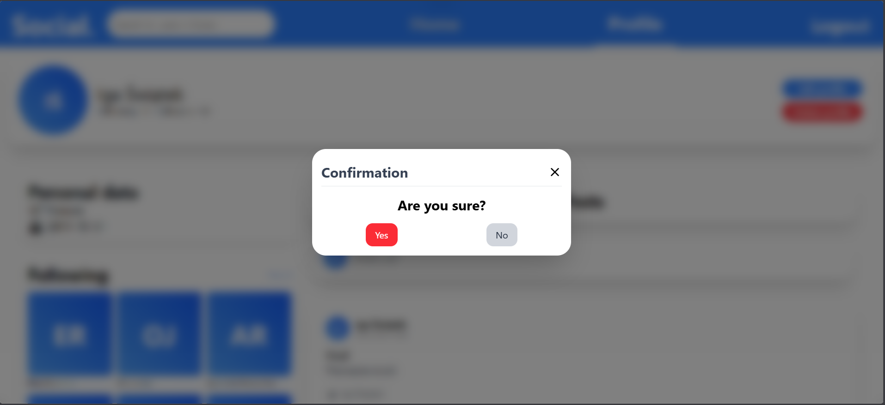

**Following list**:
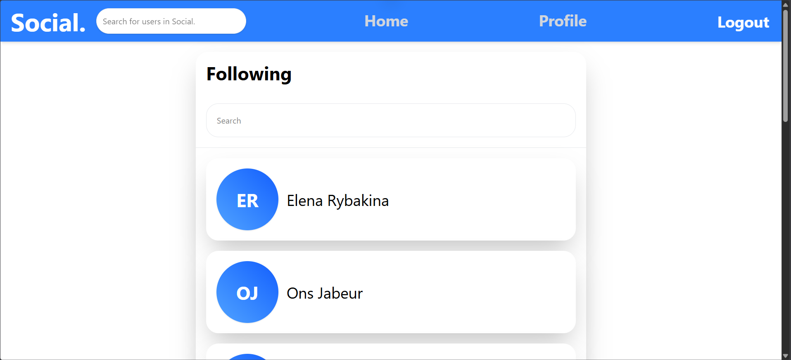

**Followers list**:
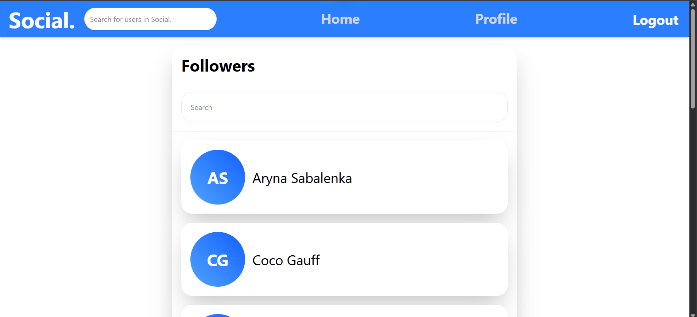


---

## Key Features

The project solves common challenges found in modern web applications:
* **Optimistic UI:** Interaction mechanisms (liking, following) update the interface instantly before receiving a server response. This includes an integrated state rollback system in case of network failures (Sad Path handling).
* **Secure Authentication:** User registration and login flows are secured using JSON Web Tokens (JWT) with strict server-side identity verification.
* **Relationship System (Followers):** Complex database structures designed to handle user-to-user following mechanisms.
* **Content Management (CRUD):** Creating, reading, updating, and deleting posts and comments, fully protected by authorization rules (users can only modify their own content).
* **Pagination & API Optimization:** Fetching large datasets (e.g., comments, likes list) in batches to prevent database bottlenecks and reduce network payload.
* **Integration & Unit Testing:** Critical frontend business logic is tested using `Vitest`, including HTTP request mocking. Backend business logic is tested using `JUnit 5` and `Mockito`.

---

## Tech Stack

### Frontend
* **React 18** (utilizing modern Hooks and Context API)
* **Vite** (as a lightning-fast bundler and dev environment)
* **Tailwind CSS** (for highly responsive and modern styling)
* **React Router Dom** (for seamless SPA navigation)
* **Vitest & Testing Library** (for reliable testing)

### Backend
* **Java 21 & Spring Boot 4**
* **Spring Security** (for endpoint protection and JWT management)
* **Spring Data JPA & Hibernate** (Data Access Layer)
* **PostgreSQL** (Relational Database Management System)
* **Springdoc OpenAPI (Swagger)** (for automated API documentation)
* **JUnit 5 & Mockito** (for reliable testing)

### DevOps & Architecture
* **Vercel** - Frontend hosting and CI/CD pipeline
* **Render** - Hosting for the Spring Boot server
* **Neon** - Hosting for the PostgreSQL database
* **Monorepo** - Codebase organized in a single repository, split into `/frontend` and `/backend` directories

---

## How to run it locally?

### Step 1: Clone the repository
```bash
git clone [https://github.com/YourUsername/Social.git](https://github.com/YourUsername/Social.git)
cd social
```

### Step 2: Run the Backend

You can run the backend using either Docker (Recommended) or natively.

#### Option A: Using Docker (Recommended)
If you have Docker installed, you can spin up the entire backend environment (PostgreSQL + Spring Boot) with a single command:
1. Navigate to the `/backend` directory.
2. Run the following command:
   ```bash
   docker-compose up -d
   ```
The backend server will start at http://localhost:8080.

### Option B: Native Setup
1. Install PostgreSQL locally and create an empty database.

2. Navigate to application.properties and update the database credentials.

3. Open the /backend folder in IntelliJ IDEA and run the SocialBackEndApplication.java file, or run it via terminal:

    - Terminal (Linux/Mac): 
        ```bash
        ./mvnw spring-boot:run
        ```

    - CMD/PowerShell (Windows):
        ```cmd
        mvnw.exe spring-boot:run
        ```

The backend server will start at `http://localhost:8080`.

### Step 3: Run the Frontend
Navigate to the /frontend directory: 

```bash
cd frontend
```

Install dependencies: 
```bash
npm install
```

Create a .env file and add the local API URL: 
```env
VITE_API_URL=http://localhost:8080
```

Start the development server: 
```bash
npm run dev
```